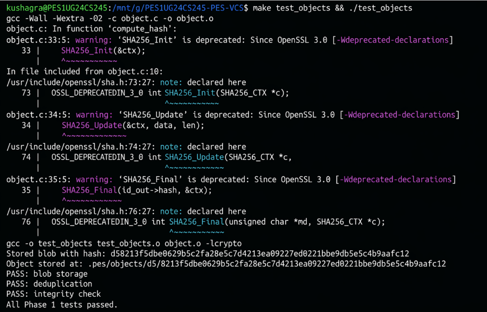
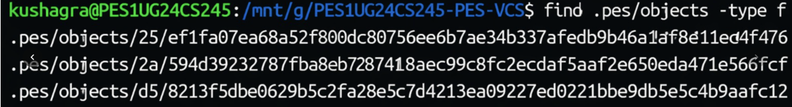
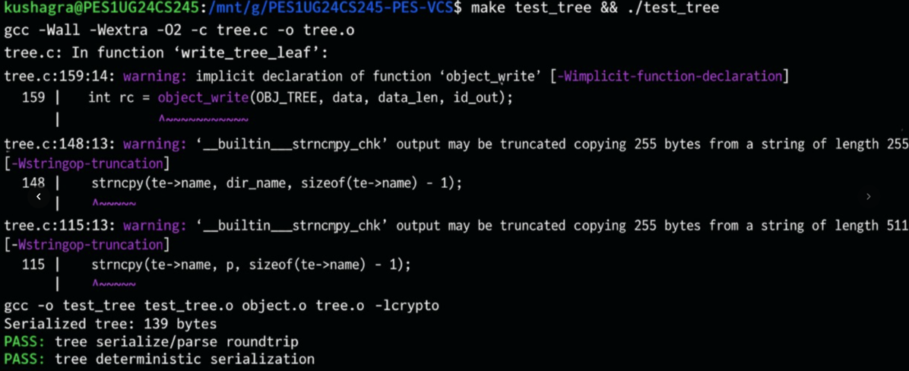
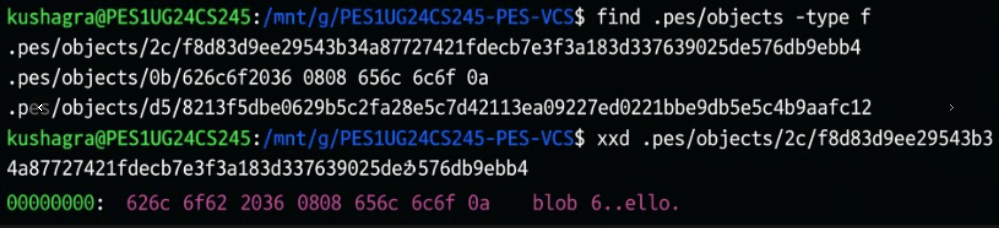
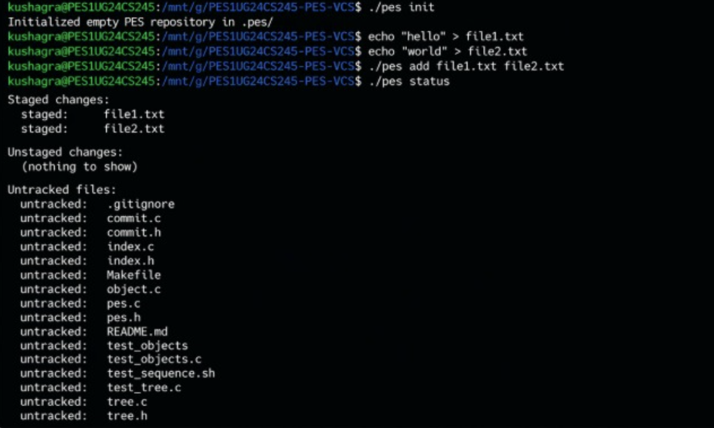
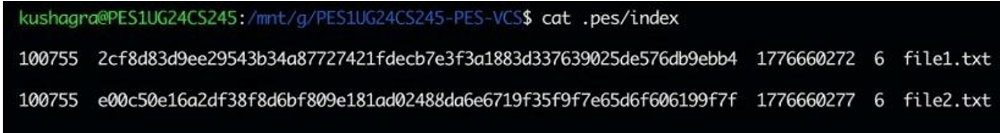
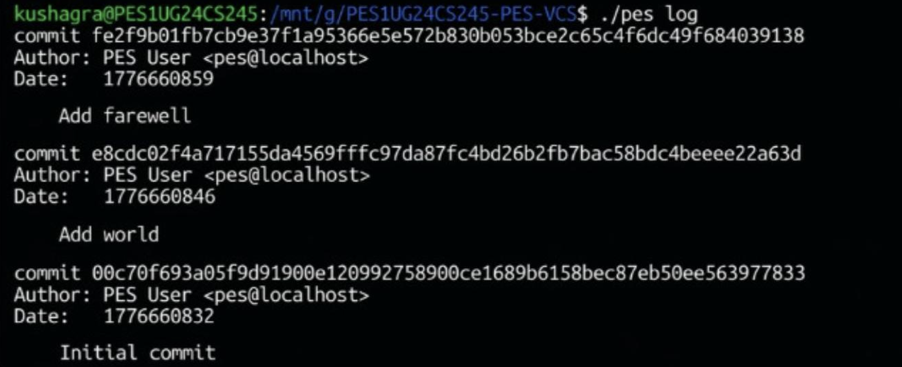
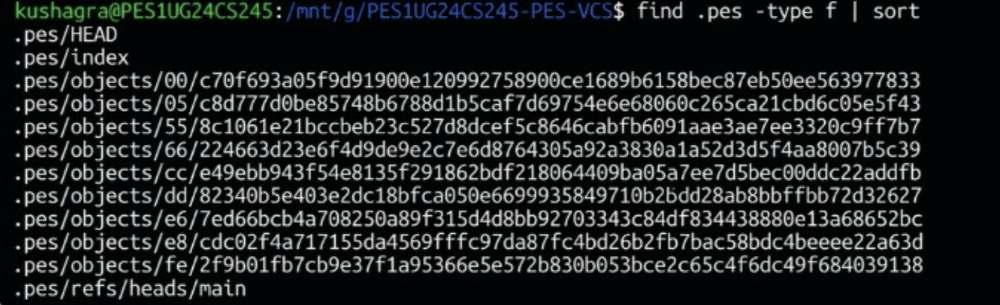
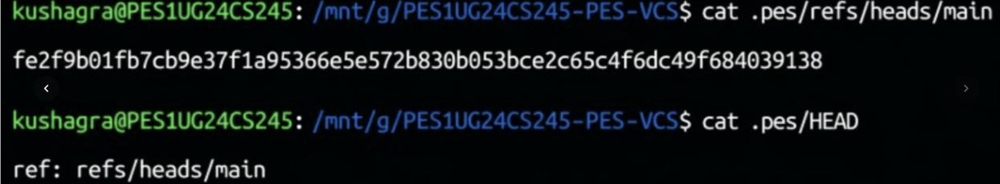
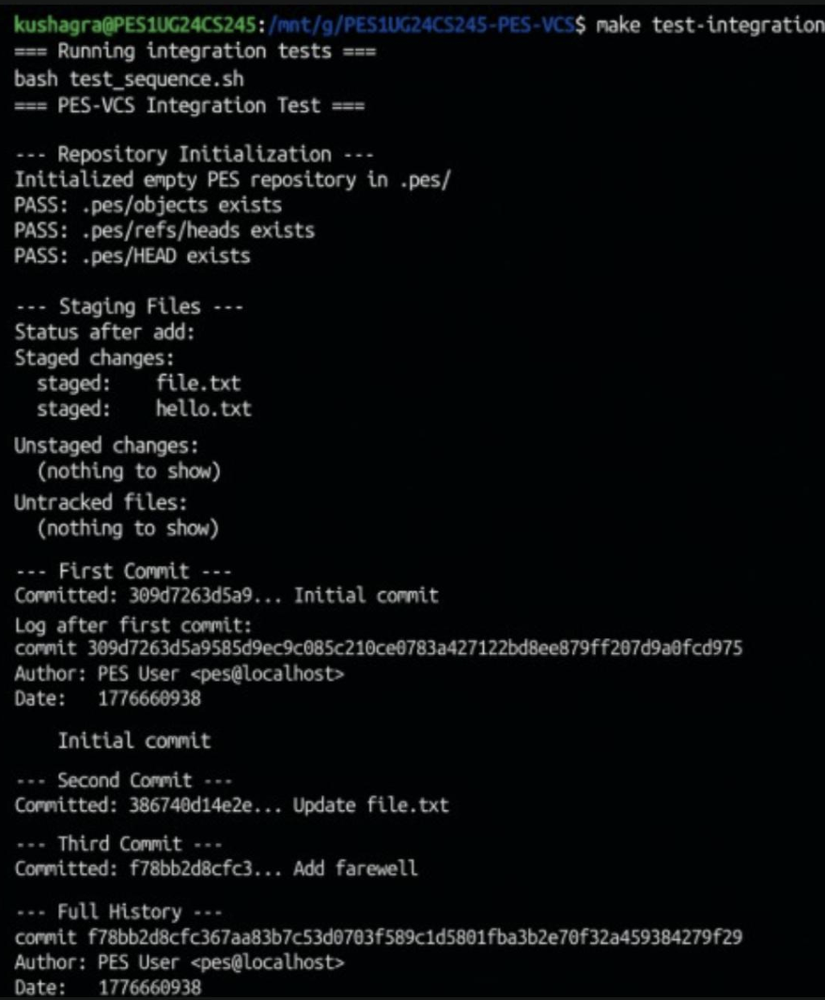

# PES-VCS Lab Report

**Name:** Kushagra Bhandari
**SRN:** PES1UG24CS245
**Repository:** [PES1UG24CS245-pes-vcs](https://github.com/18kbhandari/PES1UG24CS245-pes-vcs)

---

# 📌 Phase 1: Object Storage Foundation

## 🔹 Concepts

This phase introduces the concept of **content-addressable storage**, where data is stored and retrieved using its hash instead of its filename. The system uses **SHA-256 hashing** to ensure data integrity. Files are stored in a **sharded directory structure** using the first two characters of the hash to avoid overcrowding. Additionally, **atomic file writing** is used to prevent corruption during writes.

---

## 🔹 Implementation

Two major functions were implemented in `object.c`:

### 1. object_write

* Constructs a header of the form: `"blob <size>\0"`
* Combines header and file data
* Computes SHA-256 hash of the full object
* Stores the object in `.pes/objects/XX/` where `XX` is the first two characters of the hash
* Uses a **temporary file + rename** strategy to ensure atomic writes
* Prevents duplication (same content → same hash)

### 2. object_read

* Reads object from the filesystem
* Parses header to extract type and size
* Verifies integrity by recomputing hash
* Returns the original data portion

---

## 🔹 Testing

The implementation was tested using:

```id="8z9o7y"
make test_objects
./test_objects
```

The following were verified:

* Correct storage and retrieval of objects
* Deduplication of identical content
* Detection of corrupted objects

---

## 📸 Screenshots

<p align="center">
  
  
</p>

---

# 📌 Phase 2: Tree Objects

## 🔹 Concepts

Tree objects represent **directory structures**. Each tree contains entries mapping filenames to object hashes, along with file modes. This allows recursive representation of directories, similar to how Git stores snapshots.

---

## 🔹 Implementation

The function `tree_from_index` was implemented in `tree.c`:

* Reads entries from the index
* Groups files into hierarchical directory structure
* Handles nested paths like `src/main.c`
* Recursively creates subtree objects
* Serializes tree entries in deterministic order
* Writes tree objects to object store
* Returns the root tree hash

---

## 🔹 Testing

```id="1r6l6f"
make test_tree
./test_tree
```

Verified:

* Correct serialization and parsing
* Deterministic output regardless of input order

---

## 📸 Screenshots

<p align="center">
  
  
</p>

---

# 📌 Phase 3: Index (Staging Area)

## 🔹 Concepts

The index acts as a **staging area**, storing metadata about files before committing. It tracks file mode, hash, modification time, size, and path.

---

## 🔹 Implementation

Three functions were implemented:

### 1. index_load

* Reads `.pes/index`
* Parses each entry
* Initializes empty index if file doesn’t exist

### 2. index_save

* Writes index entries to file
* Sorts entries by path
* Uses atomic write (temp file + rename)
* Ensures durability using fsync()

### 3. index_add

* Reads file content
* Stores it as blob object
* Updates index entry
* Uses `index_find` to avoid duplicates

---

## 🔹 Testing

Commands used:

```id="wrb8a6"
./pes init
./pes add file1.txt
./pes status
```

Verified:

* Correct staging of files
* Accurate index representation
* Proper status output

---

## 📸 Screenshots

<p align="center">
  
  
</p>

---

# 📌 Phase 4: Commits and History

## 🔹 Concepts

Commits represent snapshots of the project. Each commit stores:

* Tree hash
* Parent commit hash
* Author information
* Commit message

Commits are linked together forming a history graph.

---

## 🔹 Implementation

The function `commit_create` was implemented:

* Builds tree using `tree_from_index`
* Reads parent commit from HEAD
* Generates commit metadata (author, message)
* Serializes commit object
* Stores commit in object store
* Updates `.pes/HEAD` reference

---

## 🔹 Testing

```id="rqxqtw"
./pes commit -m "Initial commit"
./pes log
make test-integration
```

Verified:

* Proper commit creation
* Correct linking of commit history
* Accurate log output

---

## 📸 Screenshots

<p align="center">
  
  
  
</p>

---

# 📌 Final Integration

All components were tested together using:

```id="7x0f0g"
make test-integration
```

---

## 📸 Screenshots

<p align="center">
  
  
</p>

---

# 📌 Phase 5 & 6: Analysis Questions

## 🔹 Q5.1 Checkout Implementation

To implement checkout, the system reads the target branch reference and updates `.pes/HEAD`. It then retrieves the corresponding commit’s tree and updates the working directory accordingly. Files not present in the new tree are removed, and existing ones are overwritten. The index is also updated. This process is complex because it must avoid overwriting uncommitted user changes.

---

## 🔹 Q5.2 Dirty Working Directory Detection

The system compares file metadata and content in the working directory with the index. If a file is modified and differs from the target commit, checkout is aborted to prevent data loss.

---

## 🔹 Q5.3 Detached HEAD

In detached HEAD state, commits are created but not referenced by any branch. These commits can become unreachable unless a new branch is created pointing to them.

---

## 🔹 Q6.1 Garbage Collection

A mark-and-sweep algorithm is used:

* Traverse reachable objects starting from HEAD and branch references
* Store hashes in a HashSet
* Delete all unreferenced objects

---

## 🔹 Q6.2 GC Race Condition

Garbage collection may delete newly created objects before they are linked to a commit. Git avoids this by delaying deletion using a grace period.

---

# 📌 Conclusion

This project successfully demonstrates how a version control system works internally, including object storage, indexing, commits, and history management.

---

# 👨‍💻 Author

Kushagra Bhandari
PES1UG24CS245

---
